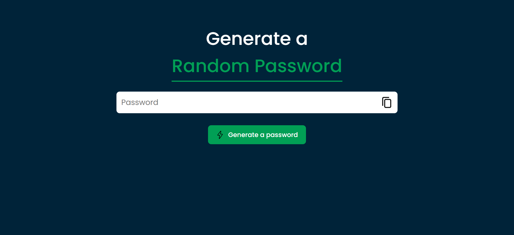

# 🔐 Random Password Generator

A simple and stylish **Random Password Generator** built with **HTML, CSS, and JavaScript**.  
This tool generates strong and secure passwords instantly and allows you to copy them with one click.

---

## 🚀 Features

- ✅ Generates random, strong, and secure passwords
- ✅ Includes uppercase, lowercase, numbers, and special characters
- ✅ One-click **copy to clipboard** functionality
- ✅ Responsive and clean UI design
- ✅ Beginner-friendly code

---

## 🖥️ Tech Stack

- **HTML5** – Structure
- **CSS3** – Styling
- **JavaScript (Vanilla JS)** – Logic

---

## 📸 Screenshot



---

## ⚙️ Installation & Usage

1. Clone the repository or download the source code.
   ```bash
   git clone https://github.com/your-username/random-password-generator.git
   ```
2. Navigate to the project folder.
3. Open index.html in your browser.
4. Click "Generate a password" and copy it using the copy icon.

📖 **How It Works**

- When you click Generate a password, JavaScript:

- Picks at least one uppercase, lowercase, number, and symbol.

- Fills the rest with random characters.

- Displays the password in the input box.

- Clicking the copy icon copies the password to your clipboard.

🔮 **Future Improvements**

- Add options to choose password length

- Add toggles for including/excluding symbols, numbers, etc.

- Dark/light mode toggle
